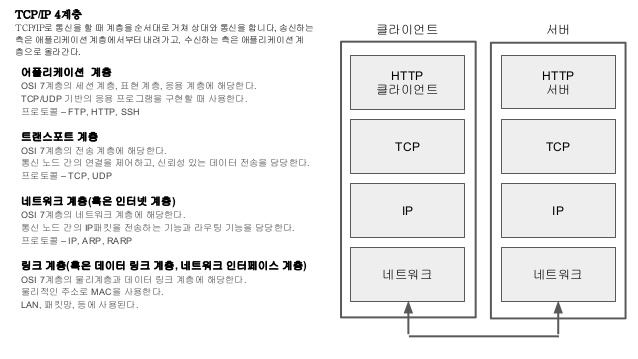
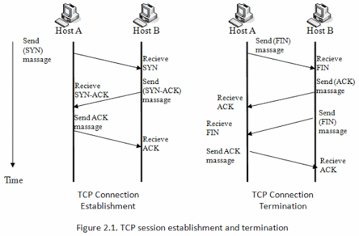
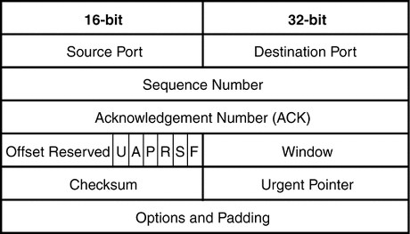
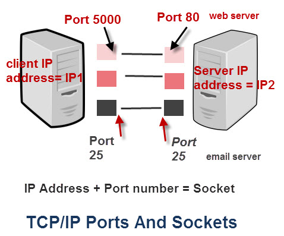

> 본 내용은 [Inflearn](https://www.inflearn.com/)의 강의 [모든 개발자를 위한 HTTP 웹 기본 지식](https://www.inflearn.com/course/http-%EC%9B%B9-%EB%84%A4%ED%8A%B8%EC%9B%8C%ED%81%AC/dashboard)을 듣고 정리한 내용입니다.
> 개인의 공부를 위해 정리한 내용인만큼 사실과 다소 다를 수 있습니다.
> 정확한 정보가 필요하신 분은 해당 강의를 참조해주세요.

> 동료, 혹은 후배 개발자에게 설명한다고 생각하고 평어체로 서술했습니다.

# [TCP](https://ko.wikipedia.org/wiki/%EC%A0%84%EC%86%A1_%EC%A0%9C%EC%96%B4_%ED%94%84%EB%A1%9C%ED%86%A0%EC%BD%9C)는 무엇일까?

TCP(Transmission Control Protocol), 한글로 직역하면 전송 제어 프로토콜이다.

TCP는 IP와 다른 통신 방법이 아니다.

프로토콜 계층 상 IP의 위에 존재한다.

> - 우리가 응용 계층을 통해 데이터를 보내면 상대 응용 계층에서 데이터가 뿅! 하고 나타나는 것 같지만
> - 매직은 없다.
>   - 응용에서 발생한 데이터가 전송->네트워크->링크 계층을 거쳐
>   - 상대 링크->네트워크->전송 계층을 통해 상대의 응용 계층으로 전달된다.
>   - 계층을 내려갈 때마다 데이터가 래핑되고 계층을 올라갈 때마다 래핑이 벗겨진다.

말 그대로 전송을 제어하는 프로토콜이다.

이건 왜 있는걸까??

## 왜 TCP가 필요할까?

TCP는 왜 탄생했을까??

[이전 포스트 (네트워크 기본 지식 - IP)](https://cckn.netlify.app/theory/network/ip/)의 IP 통신의 한계 부분을 해결하기 위한 해결책으로 TCP는 탄생했다.

다시 한번 IP 통신의 한계를 살펴보자

1. 비연결성이다.
2. 순서가 보장되지 않는다.
3. 다중 네트워크가 어렵다.

이런 문제들을 TCP는 어떻게 해결하고 있을까?

### 비연결성을 해결하는 TCP

TCP는 클라이언트와 서버의 연결을 수행하고 난 이후에 데이터를 주고 받는다 .

통신 시작에는 `3-WAY-HANDSHAKE`,
통신 마지막에는 `4-WAY-HANDSHAKE`를 수행한다.

TCP는 우선 커넥션을 형성하고 나서 데이터 통신을 수행하기 때문에 그 과정에서 서버의 상태를 확인할 수 있다.

### 순서가 보장되는 TCP

TCP 세그먼트를 살펴보자

주의 깊게 볼 점은 포트의 존재와 시퀀스 넘버(Sequence Number)이다.

시퀀스 넘버는 쉽게 생각하면 1씩 증가되는 숫자라고 보면 된다.

각 데이터마다 1씩 증가되는 숫자를 삽입해서 데이터를 전달한다.

그러다 만약 시퀀스 넘버가 순서가 맞지 않게 들어오면 ??

서버에서 클라이언트에게 해당 데이터 패킷부터 다시 보내달라고 요청하고 순서가 꼬인 데이터는 버린다.

### 다중 네트워크가 가능한 TCP

TCP 세그먼트에서 PORT를 보자

IP 패킷과 마찬가지로 `Source Port`와 `Destination Port`가 있다.

프로세스마다 다른 포트를 할당하여 통신을 수행하여 네트워크 장치에서 다중 통신을 쉽게 구현할 수 있다.
