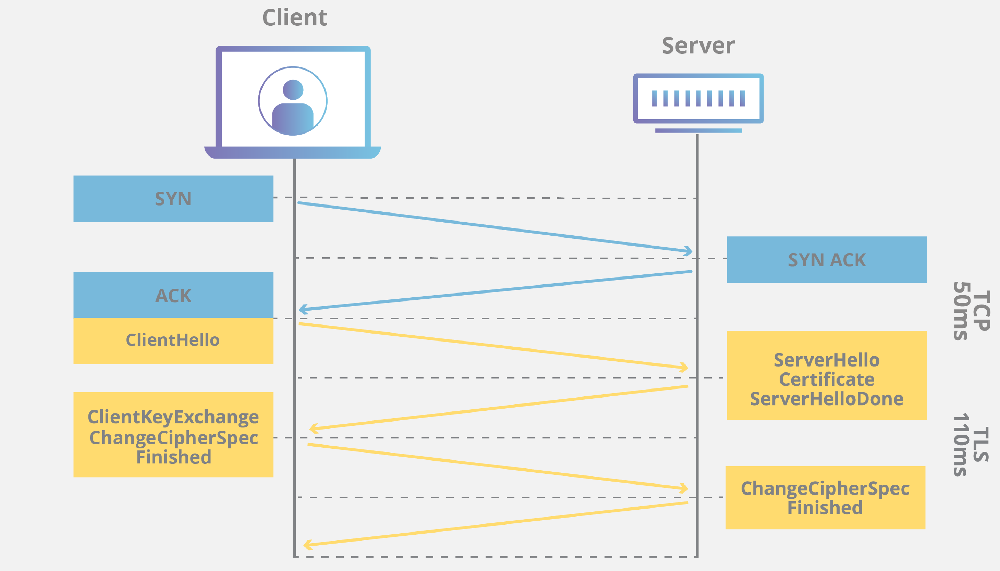

> 본 내용은 [Inflearn](https://www.inflearn.com/)의 강의 [모든 개발자를 위한 HTTP 웹 기본 지식](https://www.inflearn.com/course/http-%EC%9B%B9-%EB%84%A4%ED%8A%B8%EC%9B%8C%ED%81%AC/dashboard)을 듣고 정리한 내용입니다.
> 개인의 공부를 위해 정리한 내용인만큼 사실과 다소 다를 수 있습니다.
> 정확한 정보가 필요하신 분은 해당 강의를 참조해주세요.

> 동료, 혹은 후배 개발자에게 설명한다고 생각하고 평어체로 서술했습니다.

# [UDP](https://ko.wikipedia.org/wiki/%EC%82%AC%EC%9A%A9%EC%9E%90_%EB%8D%B0%EC%9D%B4%ED%84%B0%EA%B7%B8%EB%9E%A8_%ED%94%84%EB%A1%9C%ED%86%A0%EC%BD%9C)는 무엇일까?

UDP(User Datagram Protocol)은 무엇이고 왜 사용할까?

UDP는 TCP와 같은 Transport 계층에 속하는 통신 프로토콜이다.

온갖 기능이 들어있는 TCP에 비해 최소한의 기능만을 가지고 있는 하얀 도화지같은 프로토콜이다.

## TCP vs UDP

TCP와 UDP의 헤더를 살펴보면 어떤 차이가 있을까?

TCP는 통신에 필요한 온갖 데이터들이 들어있는데 반해 UDP는 포트 정보, Length, Checksum의 아주 기본적인 데이터만 헤더에 담겨있다.

사실상 포트만 추가된 IP 통신이라고 봐도 될듯하다.

이런 UDP는 왜 쓰는걸까?

## UDP의 사용처

위의 이미지를 살펴보면 TCP와 UDP의 차이에 대해 더 알 수 있다.

TCP에 비해 신뢰성은 떨어지지만 연결에 들어가는 시간이 없기 때문에 통신 속도가 빠르다.

음성, 영상 등의 스트리밍 서비스에서는 이미 지나간 데이터를 다시 전송하기보다는 데이터가 누락되더라도 실시간성을 보장하는 편이 낫기 때문에 UDP를 쓰곤 한다.

### 신뢰성은 TCP, 스트리밍은 UDP. 과연 그럴까?

과거에는 위와 같은 말이 정설과 같았으나 기술의 발전에 따라 스트리밍 서비스들도 UDP가 아닌 TCP로 처리가 가능해졌다.

UDP가 TCP로 대체되고 있다.

### UDP의 설 곳은 없는가?

UDP에 대한 오해 중 하나가 `UDP는 기능이 없다`는 것이다.

헤더에 포트만 들어있고 기능이 없는게 맞지 않나?

아니다. UDP는 기능이 없는 프로토콜이 아니라 `기능이 구현되지 않은 백지 같은 프로토콜`이다.

#### HTTP와 TCP/UDP

후에 다룰 HTTP는 TCP 위에 정의된 프로토콜이다.

주로 다루게 되는 HTTP는 1.1 Version이고 HTTP2는 성능을 향상시키기 위한 버전이다.

HTTP2가 나온지 4년도 되지 않아 구글에서 HTTP3가 발표됐는데 HTTP3는 UDP 기반의 프로토콜이다.

`HTTP === TCP 기반의 프로토콜`이라는 말이 이제는 오답이 되어 버렸다.

스트리밍 서비스들도 TCP로 만들어지는 지금, 왜 HTTP3는 UDP 위에 만들어졌는가?

#### QUIC

[QUIC("퀵"으로 발음)](https://ko.wikipedia.org/wiki/QUIC)는 UDP 위에 동작하는 범용 목적의 프로토콜이다.

HTTP1.1, 2에 비해 응애응애 하는 신기술이라 이론에 가까운게 아닌가 할 수 있지만 구글에서는 **모든 연결의 절반 이상**에 사용된다고 한다.

HTTP3랑 UDP 이야기하다가 왠 갑자기 QUIC?

위 아키텍쳐를 보면 이해가 갈거다.

그럼 구글이 왜, 어떻게 QUIC를 만들고 사용할까?

#### QUIC와 HTTP3에서 TCP를 사용하지 않은 이유

TCP는 안정적이다.

그러나 그만큼 느리다.

TCP 포스트에서 TCP의 연결은 3-way-handshake를 거친다고 했는데...

거기에 보안을 위한 TLS가 들어가면 어떨까?

이 데이터 시퀀스가 TCP+TLS의 커넥션 과정이다.

매 커넥션마다 이런 통신이 수행되면 그만큼 데이터 통신은 느려진다.

해당 문제를 해결하기 위해 HTTP2에서 성능 최적화를 하려고 했는데...

TCP는 이미 비대한 프로토콜이라 성능 최적화가 어려웠던 것 같다.

그래서 구글은 TCP를 뜯어고치는 대신 백지 상태에 가까운 UDP 위에 QUIC 프로토콜을 올린 것 같다.

자세한 내용은 [HTTP/3는 왜 UDP를 선택한 것일까?](https://evan-moon.github.io/2019/10/08/what-is-http3/)에 더 잘 정리되어 있어서 링크를 남긴다.
