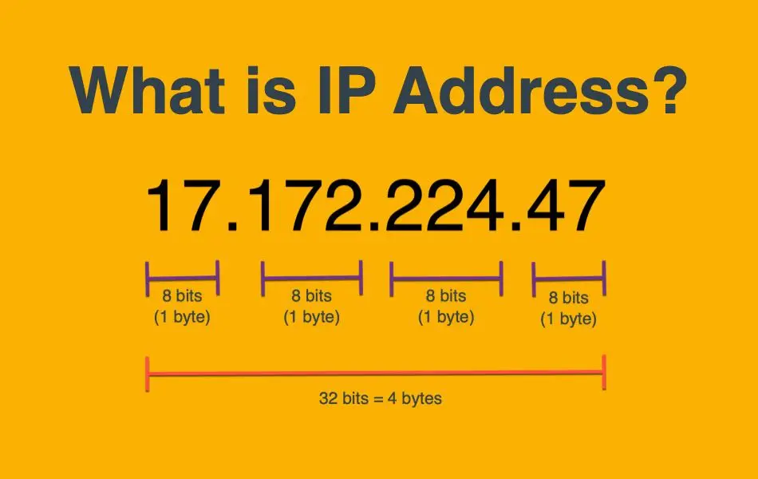
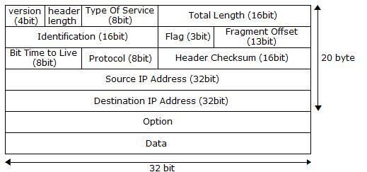
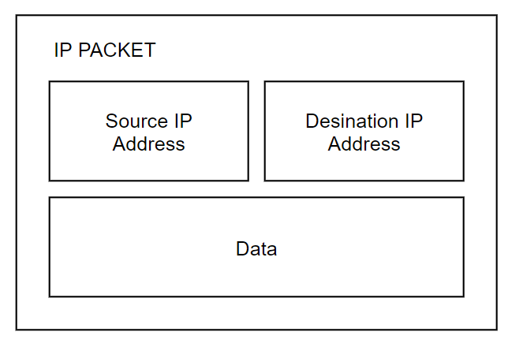

> 본 내용은 [Inflearn](https://www.inflearn.com/)의 강의 [모든 개발자를 위한 HTTP 웹 기본 지식](https://www.inflearn.com/course/http-%EC%9B%B9-%EB%84%A4%ED%8A%B8%EC%9B%8C%ED%81%AC/dashboard)을 듣고 정리한 내용입니다.
> 개인의 공부를 위해 정리한 내용인만큼 사실과 다소 다를 수 있습니다.
> 정확한 정보가 필요하신 분은 해당 강의를 참조해주세요.

> 동료, 혹은 후배 개발자에게 설명한다고 생각하고 평어체로 서술했습니다.
> 불편하신 분은 살포시 뒤로가기 해주세요.

# [IP](https://ko.wikipedia.org/wiki/IP_%EC%A3%BC%EC%86%8C)는 무엇일까?

[IP 주소](https://ko.wikipedia.org/wiki/IP_%EC%A3%BC%EC%86%8C)는 컴퓨터 네트워크에서 장치들이 서로를 인식하고 통신을 하기 위해서 사용하는 특수한 번호다.

우리가 전화 걸 때 상대방 전화번호 눌러서 거는 것처럼 네트워크에 연결된 장치들도 각자 고유한 번호를 가진다.

위 사진은 IP 헤더에 들어있는 데이터들인데 중요한 내용은 아래에 `Source IP Address`, `Desination IP Address`, `Data`라고 보면 된다.

위의 사진을 참조하여 IP [패킷](https://ko.wikipedia.org/wiki/%EB%84%A4%ED%8A%B8%EC%9B%8C%ED%81%AC_%ED%8C%A8%ED%82%B7)을 간단하게 나타내면 다음과 같다

패킷 구조에는 `보내는 사람`, `받는 사람`, `내용물`이 들어간다.

IP 통신을 수행하면 패킷은 네트워크 환경에 따라 여러 노드를 거쳐 목적지에 도착한다.

그럼 IP통신으로만 네트워크 통신을 수행하면 어떨까?

## IP 통신의 한계

### IP 통신은 순서가 보장되지 않는다.

패킷을 이용한 전달은 데이터의 크기에 제한이 걸려있기 때문에 패킷의 크기보다 큰 데이터는 잘게잘게 쪼개져서 전달된다.

패킷은 네트워크 환경에 따라 다른 경로의 노드들을 통해 목적지로 전달된다.

그래서 전송한 순서와 목적지에 도착한 순서가 다를 수 있다.

큰 데이터를 잘게잘게 나눠서 보냈는데 순서가 뒤죽박죽이면 사용하기 곤란하지 않겠는가?

### IP 통신은 비 연결성이다.

비 연결성이라는 말은 무슨 말일까??

네트워크 통신들을 실세계에 존재하는 통신 방식과 매핑해보자

IP 통신을 편지라고 생각해보자.

편지를 보내면 상대가 받았는지 어떻게 알 수 있을까?

편지가 가는 도중에

- 상대의 신변에 문제가 생겼을 수도
- 상대가 이사를 갔을 수도
- 중간에 편지가 분실됐을 수도
  있다.

상대가 답장을 보내주지 않는다면 알 수 없다.

IP 통신도 마찬가지로 데이터가 정상적으로 도착했는지, 받기는 했는지, 상대 장비가 켜져 있는지 알 수가 없다.

### IP 통신은 다중 네트워크에 애로 사항이 꽃핀다.

IP를 이용한 통신을 살펴보면 우리가 알고 있는 `PORT`가 없다. (`PORT`는 나중에 설명할 `TCP/UDP`에서 나오는 개념이다.)

상대의 PC에서 네트워크 데이터를 받는 프로그램이 n개가 동시에 돌고 있다고 생각하면 IP를 이용한 통신에서는 들어오는 데이터를 검사해서 어떤 데이터 형식인지에 따라 데이터를 프로그램들에 분배해줘야 한다.

## 대안은? TCP/UDP

위와 같은 문제점들에 대한 해결책으로 `TCP/UDP`가 등장했다.
